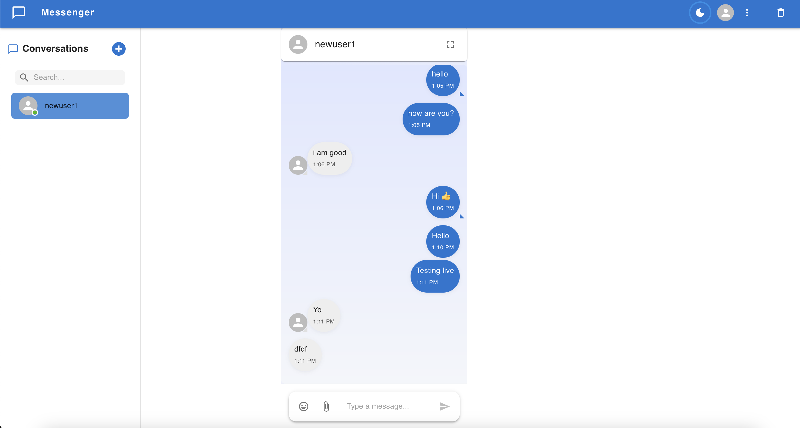

# Real-Time Messenger Application

A full-stack, real-time chat application built with the MERN stack (MongoDB, Express, React, Node.js) and Socket.IO. This project features a modern, responsive user interface inspired by popular messaging apps, complete with live messaging, user authentication, and a polished user experience.

**Live Demo:** [**https://real-time-chat-app-cyan-seven.vercel.app/**](https://real-time-chat-app-cyan-seven.vercel.app/)

---



## Features

- **Real-Time Messaging:** Instant message delivery using WebSockets (Socket.IO).
- **User Authentication:** Secure user registration and login.
- **Modern UI:**
    - Polished, responsive design that looks great on all devices.
    - Dark mode and light mode themes.
    - Messenger-style message bubbles with tails.
    - User avatars and online status indicators.
    - Emoji picker for messages.
    - Full-screen chat mode.
- **Conversation Management:**
    - Start new conversations with other registered users.
    - View all conversations in a persistent sidebar.
    - "Clear Chat" functionality.
- **User-Friendly Interface:**
    - Dropdown user menu for Profile, Settings, and Logout.
    - Intuitive icons and tooltips for all actions.
    - Smooth scrolling and UI animations.

## Tech Stack

- **Frontend:**
  - **React 18**
  - **Vite** as the build tool
  - **Material-UI (MUI)** for the component library and styling
  - **Socket.IO Client** for WebSocket communication
  - **Axios** for HTTP requests
  - **React Router** for client-side routing
- **Backend:**
  - **Node.js** with **Express.js**
  - **Socket.IO Server** for handling real-time connections
  - **MongoDB** with **Mongoose** for the database ORM
  - **JSON Web Tokens (JWT)** for authentication (if implemented)
  - **CORS** for handling cross-origin requests
- **Database:**
  - **MongoDB Atlas** (Cloud-hosted NoSQL database)
- **Deployment:**
  - **Frontend:** Vercel
  - **Backend:** Render
  - **Database:** MongoDB Atlas

---

## Getting Started

Follow these instructions to set up and run the project on your local machine for development and testing purposes.

### Prerequisites

- **Node.js** (v18 or later recommended)
- **npm** (comes with Node.js)
- A local **MongoDB** instance (optional, as the project can be pointed to a cloud instance)

### Installation & Setup

1.  **Clone the repository:**
    ```bash
    git clone https://github.com/sarthakgarg07/real-time-chat-app.git
    cd real-time-chat-app
    ```

2.  **Install Backend Dependencies:**
    ```bash
    cd server
    npm install
    ```

3.  **Install Frontend Dependencies:**
    ```bash
    cd ../client
    npm install
    ```

4.  **Set Up Environment Variables:**
    -   In the `server` directory, create a new file named `.env`.
    -   Add the following environment variables. You can get the `MONGO_URI` from your MongoDB Atlas dashboard.

    ```env
    # Your MongoDB Atlas connection string
    MONGO_URI=mongodb+srv://<username>:<password>@cluster...
    
    # Port for the server to run on
    PORT=5001
    
    # A secret key for JWT (optional, if you implement it)
    JWT_SECRET=your_super_secret_jwt_key
    ```
    
    -   (Optional) In the `client` directory, you can create a `.env.local` file to override the backend URL for local development:
    ```env
    VITE_API_URL=http://localhost:5001
    ```

### Running the Application

1.  **Start the Backend Server:**
    -   From the `server` directory, run:
    ```bash
    npm run dev
    ```
    The backend server should now be running on `http://localhost:5001`.

2.  **Start the Frontend Development Server:**
    -   From the `client` directory, run:
    ```bash
    npm run dev
    ```
    The React application should now be running on `http://localhost:5173`.

3.  **Open the App:**
    -   Open your web browser and navigate to `http://localhost:5173`. You should see the login page.
